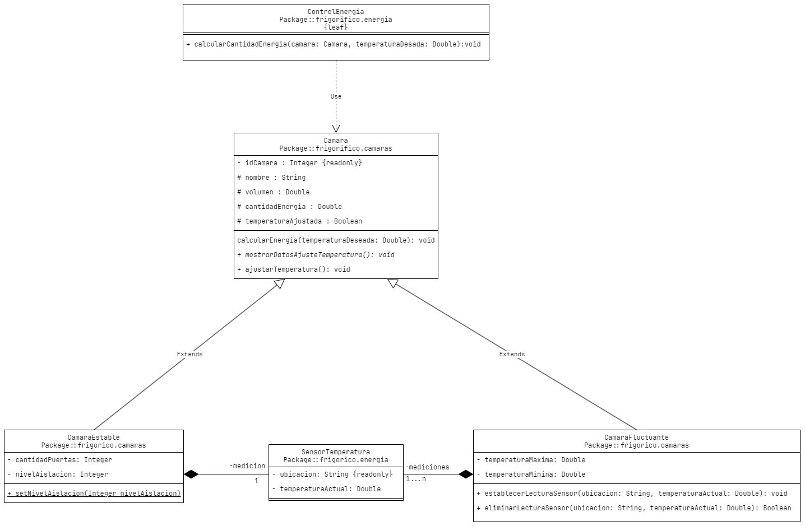

# MODELO M35455_4
## Autor: Prof. Mauricio Fariello

Dado el siguiente diagrama de clases en UML, que modela un sistema de control de temperatura para un frigorífico.



Se requiere implementar un modelo 00 en Java, que cumpla con las especificaciones del diagrama y con las siguientes funcionalidades:
1. El sistema debe permitir calcular la cantidad de energía (clase `ControlEnergia`) necesaria para ajustar la temperatura en cámaras estables (clase `CamaraEstable`) y cámaras fluctuantes (clase `CamaraFluctuante`). Para realizar el cálculo el sistema debe permitir registrar la medición de un sensor de temperatura (clase Sensor Temperatura) para cámaras estables y debe permitir registrar más de una medición para cámaras fluctuantes. Además:

   ​	a. Considere agregar los métodos y atributos no incluidos en el modelo que necesite.
   ​	b. Considere como unidades de medida grados Celsius(ºC) para la temperatura, kilojulios(kj) para la cantidad de energía y metros cúbicos (m³) para el volumen.

2. El método `calcularEnergia` debe calcular la cantidad de energía necesaria para ajustar la temperatura, llamando a `calcularCantidadEnergia`. Además, debe asignar el valor calculado al atributo `cantidadEnergia`.

3. El método `ajustarTemperatura` debe registrar que la temperatura de la cámara fue establecida, para lo cual debe colocar el valor de **verdadero** en el atributo `temperaturaAjustada`.

4. El método `calcularCantidadEnergia` deberá realizar el cálculo de Ia cantidad de energía necesaria para establecer Ia temperatura deseada. El cálculo dependerá del tipo de cámara según el siguiente detalle:

  ​	a. `CamaraEstable`: `nivelAislacion * (temperaturaActual - temperaturaDeseada) * volumen`.

  ​		i. `nivelAislacion`: es atributo de `CamaraEstable`.
  ​		ii. `temperaturaActual`: es atributo de Sensor Temperatura.
  ​		iii. `temperaturaDeseada`: es argumento de la función `calcularCantidadEnergia`.
  ​		iv. `volumen`: es atributo de `Camara`

  ​	b. `CamaraFluctuante: temperaturaTotal * volumen` .
  ​		i. `temperaturaTotal`: es la sumatoria algebraica de la `temperaturaActual` de cada medición menos la `temperaturaDeseada`.

  ​			1.-`temperaturaActual`: es atributo de `SensorTemperatura`. Se obtiene recorriendo el contenedor mediciones.

  ​			2.-`temperaturaDeseada`: es argumento de la función `calcularCantidadEnergia`.
  ​		ii. `volumen`: es atributo de `Camara`.

5. Utilice el método `setNivelAislacion` para encapsular el `nivelAislacion` de tal manera que solo pueda tener valores entre **1** y **5**. Cree y utilice una nueva excepción `NivelAislacionlncorrecto` que muestre un *mensaje de error y los valores permitidos*, cuando dicho rango no se respete.

6. El método `establecerLecturaSensor` agrega un `SensorTemperatura` al **ArrayList** mediciones de tal manera de establecer la relación de *composición* entre `CamaraFluctuante` y `SensorTemperatura`.

7. El método `eliminarLecturaSensor` elimina un `SensorTemperatura` del **ArrayList** mediciones. Para lo cual es necesario buscar el objeto en el **ArrayList** identificando el mismo con la *ubicación* (atributo `ubicacion`) y *temperatura acutal* (atributo `temperaturaActual`). Además, debe retornar **verdadero** o **falso** acorde al resultado de la operación de eliminación, es decir si pudo o no encontrar y eliminar la medición.

8. La clase `SensorTemperatura` debe contar con un **constructor sobrecargado**, de tal manera de poder instanciar objetos del tipo `SensorTemperatura` *con o sin la temperatura actual*. *Inicializar* en **99** la `temperaturaActual` para el constructor que así lo requiera.

9. El valor de `idCamara` debe ser un *número único correlativo*. *Obtenga dicho número con un nuevo atributo de clase*.

10. Verifique el funcionamiento a través de un método `main` de tal manera que se pueda observar:

  ​	a. La creación de *2 cámaras estables* y *2 cámaras fluctuantes*.
  ​	b. El intento de crear una *cámara estable con un nivel de aislante fuera del rango permitido*.
  ​	c. Para una de las *cámaras fluctuantes*:
  ​		i. *Establecer 3 lecturas de sensor.*
  ​		Ii. *La eliminación de una de las 3 lecturas de sensor existentes*.
  ​		iii. *El intento fallido de eliminación de una lectura de sensor inexistente*.
  ​	d. Mostrar los datos de ajuste de temperatura de los 4 objetos creados utilizando el método `mostrarDatosAjusteTemperatura`. La siguiente es una salida por consola representativa:

```BASH
El nivel de aislación es incorrecto. El rango de valores permitidos es entre 1 y 5.
Medición inexistente.

Nombre de la "camara estable": Camara A
Nivel de aislación: 2
Cantidad de energía necesaria: 32.000,0 Kj
Estado de la temperatura: ajustada.

Nombre de la "camara fluctuante": Camara C
Temperatura mínima:  3,00ºC
Temperatura máxima: 30,00ºC
Cantidad de energía necesaria: 32.400,0 kj
Estado nivelación: nivelado.

Nombre de la "camara estable": Camara B
Estado de la temperatura: NO ajustada.
Nombre de la "camara fluctuante": Camara D
Temperatura mínima:  1,00ºC
Temperatura máxima: 31,00ºC\
Estado nivelación: NO ajustado.
```


El proyecto se debe entregar en un archivo comprimido (.zip o .rar) y de tal forma que
en su ejecución se pueda verificar el funcionamiento correcto de lo establecido en las premisas dadas y criterios generales aplicados para calificar la entrega de la Tarea.
Nombrar al archivo de la siguiente manera: `nombreApellidoLegajo_codigomodelo.zip`
(donde código modelo es el código que se encuentra en el encabezado de su tema asignado)
Ejemplo: